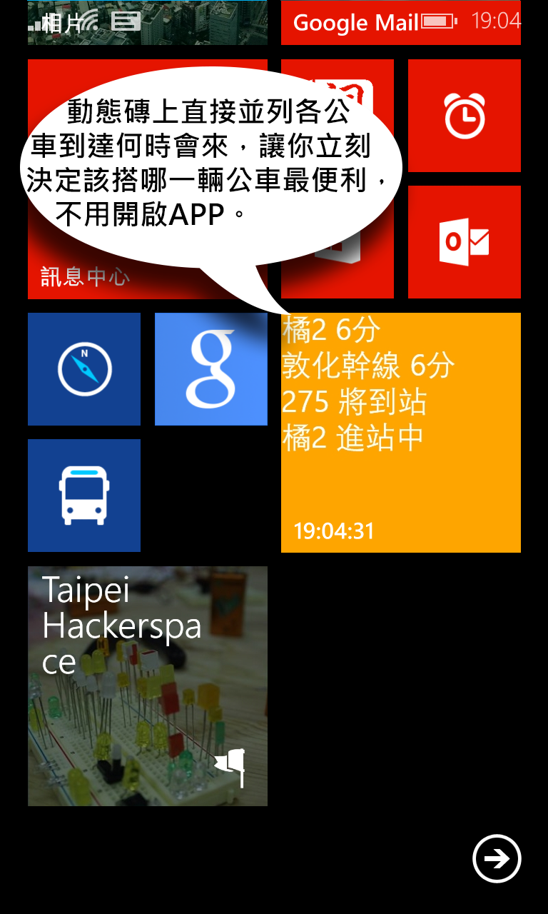

LiveBusTile 台北巴士快速磚
===========
使用WindowsPhone8的Hub Tile即時顯示台北市公車狀態，不需要進入App。此PeriodicTask會每隔60sec到5284.pda網站更新一次橘2與275的訊息。

此LiveBusTile是以「站牌」的狀態為主，不像其他的App是以「公車」的狀態為中心。

把常看的公車站牌同時秀在一個動態磚上。
比如說，要出門上班時可以選橘2與275，但不知道哪一個先來，而且兩個站牌是在不同地方。本程式可讓兩個公車站牌並列秀出，讓你立刻可以決定。
背景程式會定時取得資訊，只要解鎖手機看桌面動態磚就立刻可以決定，甚至不用開啟進入程式。
可將公車站牌依照標籤分類為「上班」、「回家」，或是自定的標籤。

